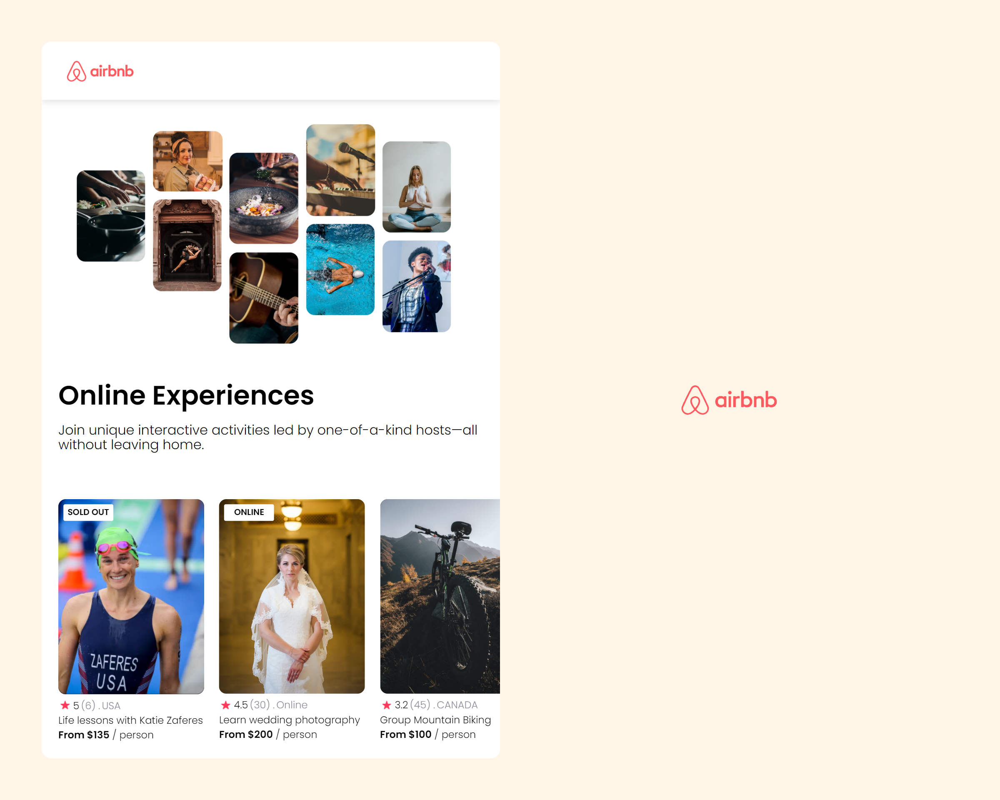

# Airbnb Experiences Clone - React App




## Run Locally

Clone the project

```bash
  git clone https://github.com/RudraG4/airbnb-exp-clone
```

Go to the project directory

```bash
  cd airbnb-exp-clone
```

Install dependencies

```bash
  npm install
```

Start the server

```bash
  npm start
```
